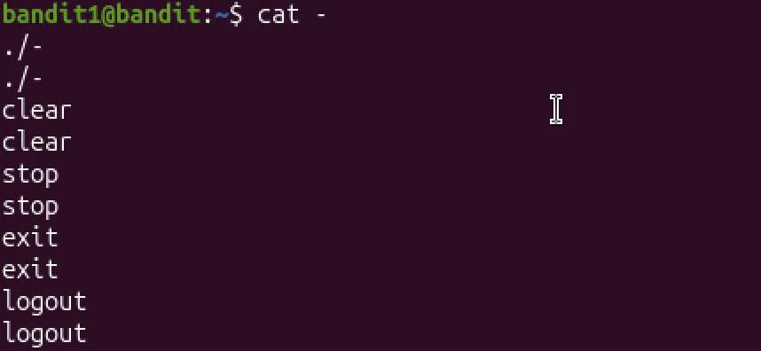

# Mission:
 Find the password located in "-" file.

# Step:
 Use `ls` to list all the file.\
 Then you will find a file "-", but when i use 
 ` cat - ` 
 nothing happen, so i google "dashed filename" as Helpful Reading Material said.\
 Google AI said "In Linux and Unix systems, a dashed filename refers to a file whose name begins with a dash or hyphen (- or --)."\
 So you have to use `cat ./-` or `cat -- -filename`.
 Before that, my terminal look like this:
 
 So i have to enter "Ctrl + C" to stop the terminal.
 ```bash
    cat ./-
 ```
 And the password is: 
