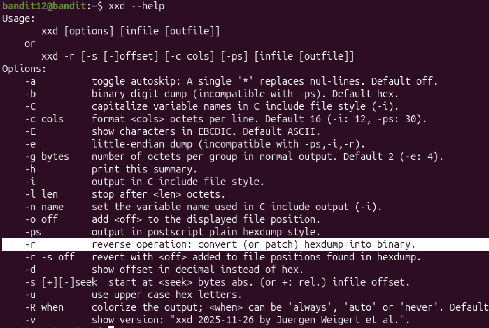
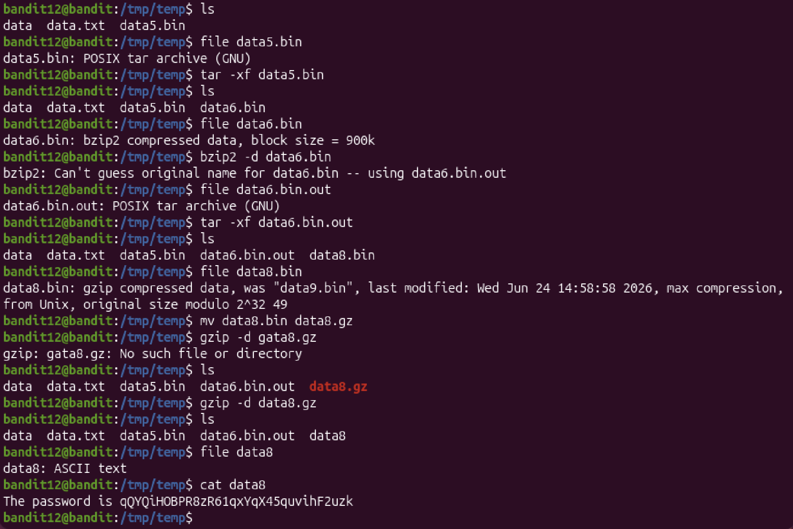

# Mission:
 The password is stored in the file data.txt, which is a hexdump of a file and has been repeatedly compressed.


# Steps:

 First, i need to change the file from hexdump to binary so that i can run the file.

 ### -> Use `xxd` command.

 For detail, use `xxd -r` to convert hexdump into binary

 

 But before that, i need to move `data.txt` to temp directory because i don't have a permission on bandit system.


 ```bash
 mkdir /tmp/temp
 ```


 ## Usage:
 + `mkdir [OPTION]... DIRECTORY...`


 #### Then copy `data.txt` to /tmp/temp
 ```bash
 cp data.txt /tmp/temp
 ```

 ## Usage:
 + `cp [OPTION]... [-T] SOURCE DEST`
 + `or:  cp [OPTION]... SOURCE... DIRECTORY`
 + `or:  cp [OPTION]... -t DIRECTORY SOURCE...`\
 -> Copy SOURCE to DEST, or multiple SOURCE(s) to DIRECTORY.

 
 #### Moving to /tmp/temp directory
 ```bash
 cd /tmp/temp
 ```
 
 Convert hexdump into binary:
 ```bash 
  xxd -r data.txt data
 ```


 ## Gzip
 ### 
 After convert, the data file now is compressed using gzip, so i can decomressed using `gzip -d` command. But before that, the `data` should in `.gz` form.

 ```bash
  bandit12@bandit:/tmp/temp$ mv data data.gz
  bandit12@bandit:/tmp/temp$ gzip -d data.gz
  bandit12@bandit:/tmp/temp$ ls
  data  data.txt
 ```

 Check what type data is
 ```bash
  bandit12@bandit:/tmp/temp$ file data
  data: bzip2 compressed data, block size = 900k
 ```

 ## Bzip
 It is compressed using bzip2. So for decompressed bzip2, i use `bzip2` command.

 ```bash
  bandit12@bandit:/tmp/temp$ bzip2 -d data
  bzip2: Can't guess original name for data -- using data.out
  bandit12@bandit:/tmp/temp$ ls
  data.out  data.txt
 ```
 
 Continue check what type `data.out` is
 ```bash
  bandit12@bandit:/tmp/temp$ file data.out
  data.out: gzip compressed data, was "data4.bin", last modified: Wed Jun 24 14:58:58 2026, max compression, from Unix, original size modulo 2^32 20480
 ```

 Use `gzip` to decompressed it again:
 ```bash
  bandit12@bandit:/tmp/temp$ mv data.out data.gz
  bandit12@bandit:/tmp/temp$ gzip -d data.gz
  bandit12@bandit:/tmp/temp$ ls
  data  data.txt
 ```

 ## Tar
 

 ### This time, the data is compressed using `tar`, so i use `tar` command.

 ## Usage:
  `tar [OPTION...] [FILE]...`

  Examples:

  + tar -cf archive.tar foo bar  # Create archive.tar from files foo and bar.

  + tar -tvf archive.tar         # List all files in archive.tar verbosely.

  + tar -xf archive.tar          # Extract all files from archive.tar.

 To extract `data`, i use `-xf`.

 ```bash
 bandit12@bandit:/tmp/temp$ tar -xf data
 bandit12@bandit:/tmp/temp$ ls
 data  data.txt  data5.bin
 ```

 

 After repeating using gzip,bzip,tar, i get the password.

 The password: `qQYQiHOBPR8zR61qxYqX45quvihF2uzk`


