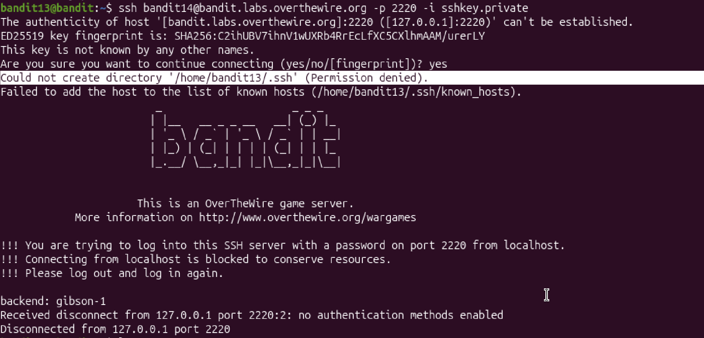
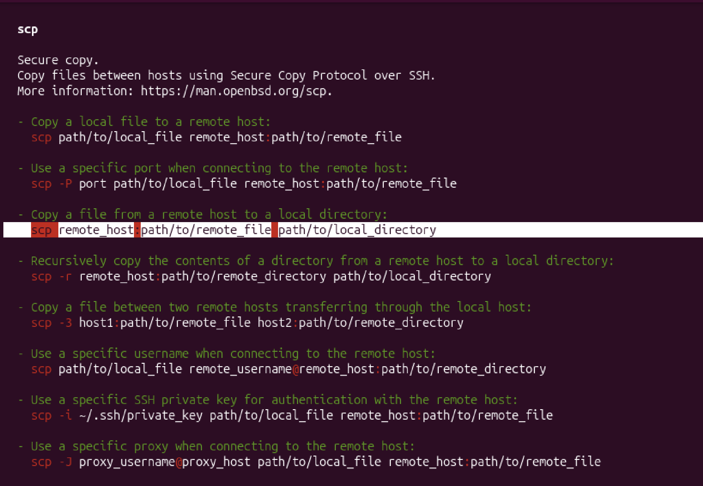
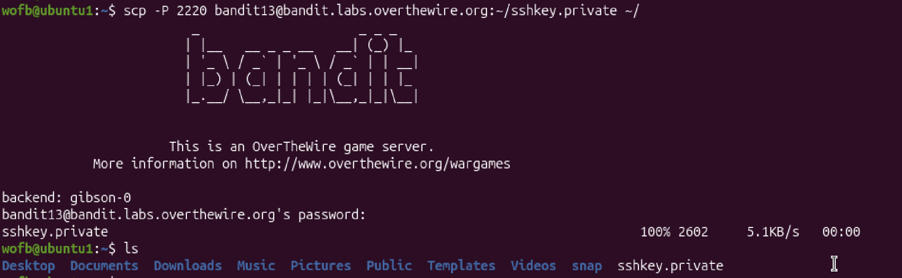
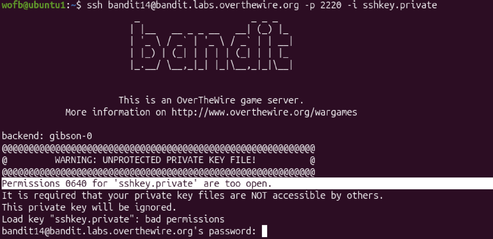
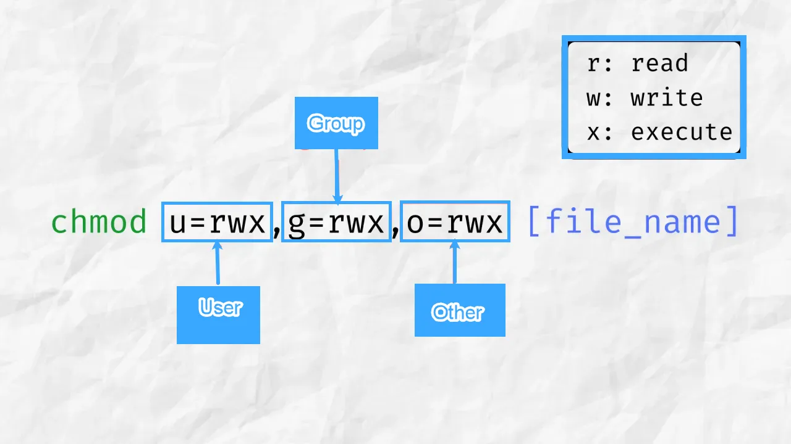
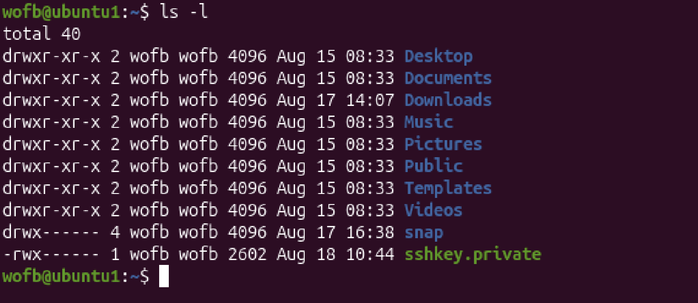
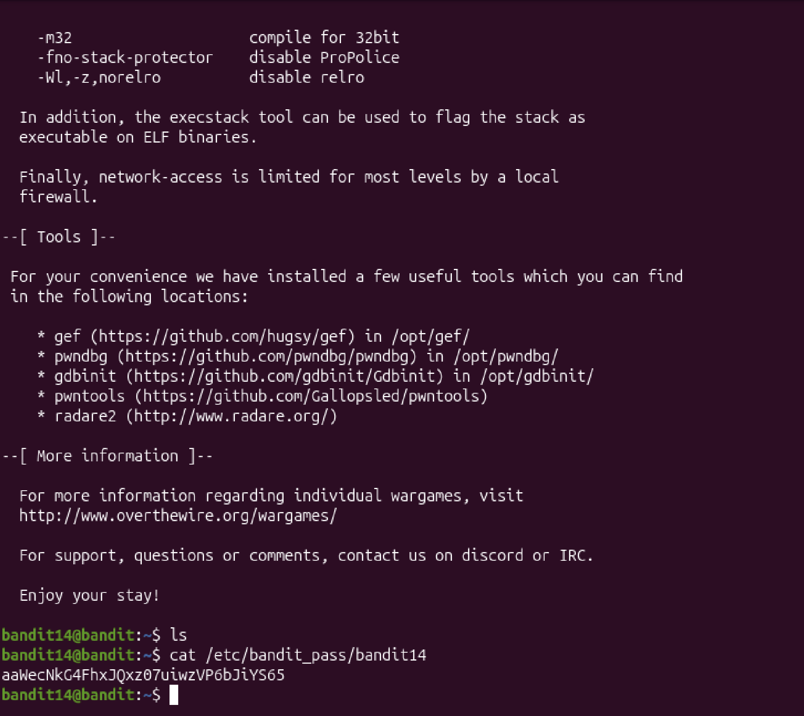

# Mission:
 Find the password stored in `/etc/bandit_pass/bandit14` which can only be read by user `bandit14`.

# Step:
 # .SSH
At this level, i get a `private SSH key` that can be used to log into `bandit14`. To use a `private key`, i will use `ssh` command, in details : `ssh -i`.


 ```bash
 bandit13@bandit:~$ ssh bandit14@bandit.labs.overthewire.org -p 2220 -i sshkey.private
 ```


 
 But i got this error, because `bandit13` don't have `.ssh` directory(`.ssh` help us using `ssh` command). So to solve this problem, i have to move the `sshkey.private` from `bandit13` to mine server.

 # SCP:
 ### The `scp` command help us to move file from remote server to another server.

 

 ## scp `[user@]host:[path]`
 ```bash
  `scp -P 2220 bandit13@bandit.labs.overthewire.org:~/sshkey.private ~/`
 ```

 ## Explain the command:
 + `-P 2220`: i want to connect to bandit13 at port 22220

 + `bandit13@bandit.labs.overthewire.org`: remote's user where i want to copy a file is `bandit13`, host is `bandit.labs.overthewire.org`.

 + `:~/sshkey.private`: this is the path `/home/bandit13/sshkey.private`, in Linux, `~/` is a command-line shortcut that represents the home directory of the currently logged-in user.

 + `~/`: This is the path in my server where i want to put the `sshkey.private` in, in details: `/home/wofb/`.

 


 # Chmod
 Now, i have the `sshkey.private` in my machine, and ofc, i also have `.ssh` directory. I can use:
 `ssh bandit14@bandit.labs.overthewire.org -p 2220 -i sshkey.private`

 ```bash
 ssh bandit14@bandit.labs.overthewire.org -p 2220 -i sshkey.private
 ```

 

 But it continue to have error, i see that **Permission for `sshkey.private` are too open, which means i have to edit the permission for this file**.

 ## `Chmod` command help me change the access permission of a file/directory.



 There is 2 ways to use `chmod`:
 + Numeric(Octal) mode: 
    + Each permission has a value: Read = 4, Write = 2, and Execute = 1. Add these numbers together to get a three-digit code(User, Group, Other). For exp:
        + 777:All users can do everything
        + 700:Only the owner has access
        + ...

 + Symbolic mode: Use symbols plus(`+`), minus(`-`), equal(`=`), to change the permission:
    + chmod +x script.sh – Makes a script executable for everyone.
    + chmod g-w document.txt – Removes write permission from the group.
    + chmod o=r data.csv – Sets permissions so "others" can only read the file.
    
 For quick, i will use Numeric mode.
 ```bash
 wofb@ubuntu1:~$ chmod 700 sshkey.private
 ```

 Check the permission:
 

 As i see, now the private key is set to only the owner can read,write and execute.

 

 The password: `aaWecNkG4FhxJQxz07uiwzVP6bJiYS65`.
 
 


