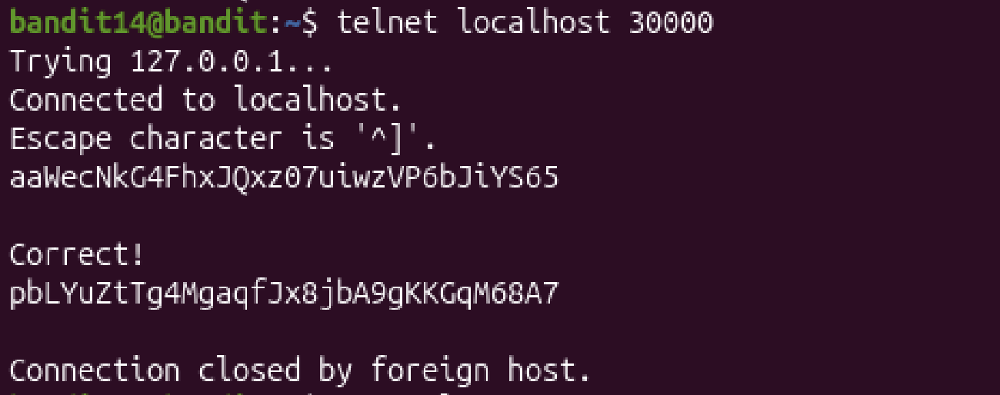

# Mission:
 Connect to port 30000 on localhost to get the password.

# Step
 
 At this level, to connect to port 30000 on localhost, i use `telnet` command - Connect to a specified port of a host using the telnet protocol.

 ## Usage:
 + `telnet [options ...] [host [port]]`

 

 The password: `pbLYuZtTg4MgaqfJx8jbA9gKKGqM68A7`.