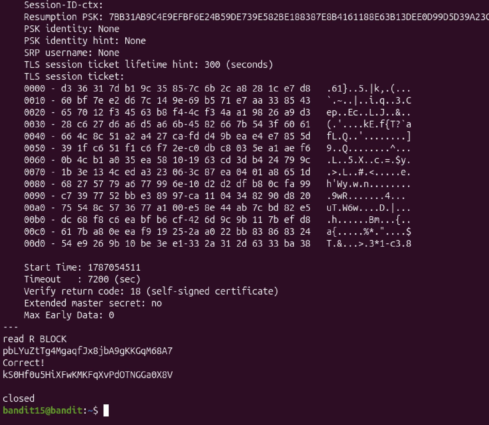

# Mission:
 Connect to port 30001 on localhost using SSL encryption to get the password.

# Steps:

 Using `openssl` command -  OpenSSL cryptographic toolkit. Combine with ` s_client` to connect by port and localhost.

 ## Usage: `s_client [options] [host:port]`

 ```bash
  bandit15@bandit:~$ openssl s_client localhost:30001
 ```

 

 We have found the password for the next level !!!

 The password: `kS0Hf0u5HiXFwKMKFqXvPdOTNGGa0X8V`
