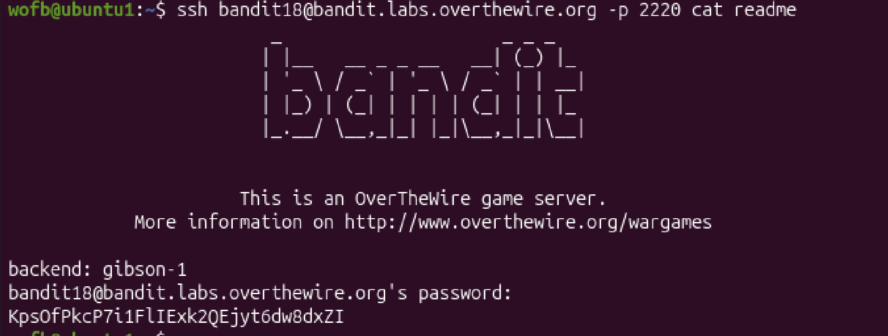

# Mission:
 The password for the next level is stored in a file readme in the homedirectory

# Steps:

 I trying to login bandit18, but i continually receive:
 ```bash
 Byebye !
 Connection to bandit.labs.overthewire.org closed.
 ```

 But i know that the password for bandit19 in a file `readme` which is located in the homedirectory. So i think i will combine the `ssh` command with `cat` command to read the `readme` file immediately after logging in.

 

 The password: `KpsOfPkcP7i1FlIExk2QEjyt6dw8dxZI`