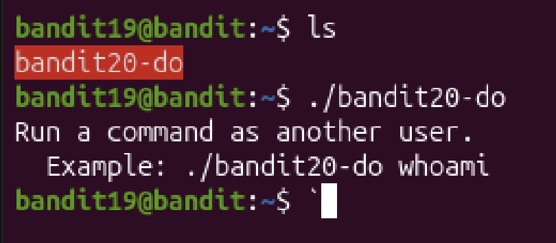
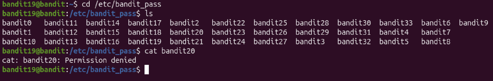
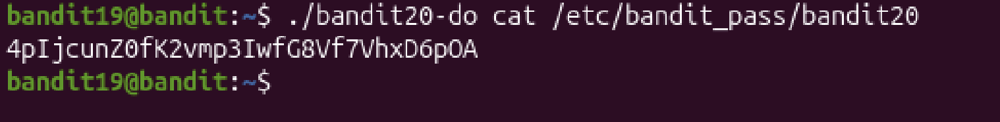

# Mission:
 The password is in /etc/bandit_pass.

# Steps:
 

 In homedirectory of `bandit19`, i have `bandit20-do` which is a `setuid binary`, to execute it, i use `./` command

 In Linux, `./` means "the current directory." The dot (.) stands for the folder you are in right now, and the slash (/) separates folder names. So `./` can be understood as `/home/bandit19/bandit20-do`.

 A setupid binary can help me to execute a file with the owner permission. For example:

 

 When i try to read `bandit20`, i read it as `other`, but `bandit20` can only be read by `owner`, so using `./bandit20-do` will help me read it as `owner`.

 

 The Password: `4pIjcunZ0fK2vmp3IwfG8Vf7VhxD6pOA`
