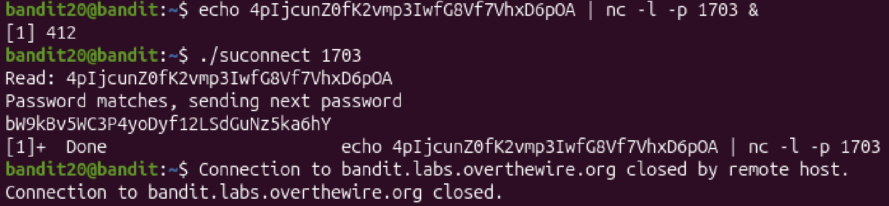

# Mission:

 There is a setuid binary in the homedirectory that does the following: it makes a connection to localhost on the port you specify as a commandline argument. It then reads a line of text from the connection and compares it to the password in the previous level (bandit20). If the password is correct, it will transmit the password for the next level (bandit21).

# Steps:

 At this level, i will have to create a listener on the specific port, to create a listener, i use `nc` command:

 ```bash
 nc -l -p port &
 ```

 ## Explain the code:
 + `-l`: Listen for an incoming connection  rather  than  initiating  a  connection  to  a  remote  host.   The destination  and  port to listen on can be specified either as non-optional arguments, or with options `-s` and `-p` respectively.

 + `-p`: Specify the source port `nc` should use.

 + `&`: The code running in the background.

 And i want this port can send the password in `bandit19` back so i will combine with `echo`:

 ```bash
 echo 4pIjcunZ0fK2vmp3IwfG8Vf7VhxD6pOA
 ```

 The `nc` command should be after the `echo` command because the system will run `echo` first, printing the password; then, when the port opens, the password will appear too.

 

 The Password:`bW9kBv5WC3P4yoDyf12LSdGuNz5ka6hY`.

