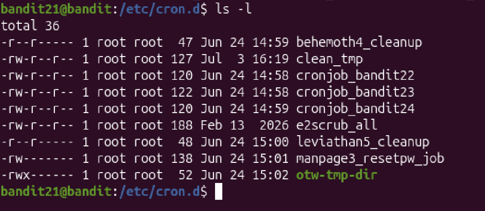
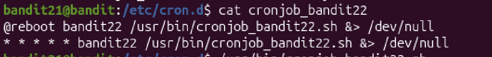
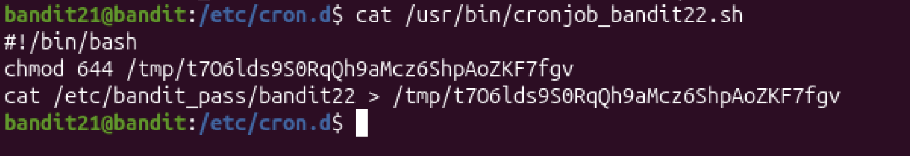
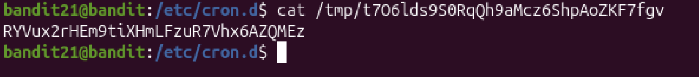

# Mission:

 In `/etc/cron.d/` driectory there is a program running automatically at regular intervals find what command is being executed.

# Steps:

 First, i will change directory to `/etc/cron.d/`.
 ```bash
  cd /etc/cron.d/
 ```

 

 I'm in `bandit21`, so i will want to `cat bandit22` to find out the password.
 
 

 ## Break down the code:
 + `@reboot`: This means it will execute when once when the system reboot.
 + `&>`: There are two separate streams of output `stdout` and `stderr`, where `stdout` stands for the succesful command and `stderr` stand for error messages. `&>` help the system will not print both `stdout` and `stderr` on the screen, instead, they will be transport into a new destination.
 + `/dev/null`: This is the new destination for `stdout` and `stderr`, `/dev/null` often called `blackhole`.

 + `* * * * *`: Each star stand for shcedule task. Minute, Hour, Day of the Month, Month, Day of the Week.

 So this code can be understood as `cronjob_bandit22.sh` will automatically run when reboot and run every minute, and the output of the file won't print on the screen.


 ## Read cronjob_bandit22.sh and get the password.
 

 After read `cronjob_bandit22.sh`, i can see that it was change the permission of `/tmp/t7O6lds9S0RqQh9aMcz6ShpAoZKF7fgv` to `644` so that i can read `/tmp/t7O6lds9S0RqQh9aMcz6ShpAoZKF7fgv`, and it also move the password from`/etc/bandit_pass/bandit22` to `/tmp/t7O6lds9S0RqQh9aMcz6ShpAoZKF7fgv`.

 Read the path and get the password.
 

 The password: `RYVux2rHEm9tiXHmLFzuR7Vhx6AZQMEz`.


 