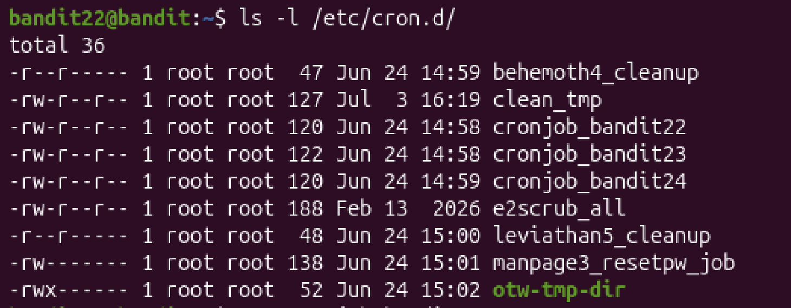
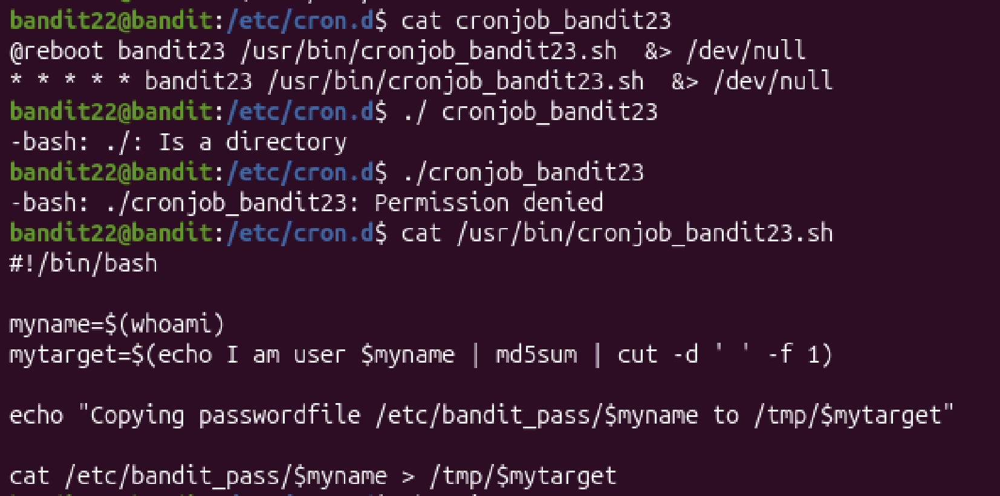
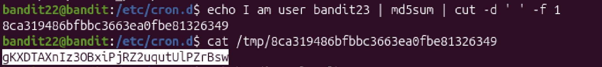

# Mission:
 Like the previous level. Look in `/etc/cron.d/` and see what cmmand is being execute.

# Steps:

 

 I will want to read in `cronjob_bandit23`.

 

 It say that the name of user `whoami` save in `myname`(At this level is `bandit23`), and the target where the password for `bandit23` will print out after i run the comman `echo I am user $myname | md5sum | cut -d ' ' -f 1)`.

 
 The password: `gKXDTAXnIz3OBxiPjRZ2uqutUlPZrBsw`.