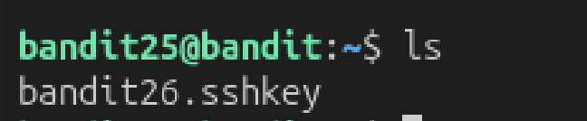
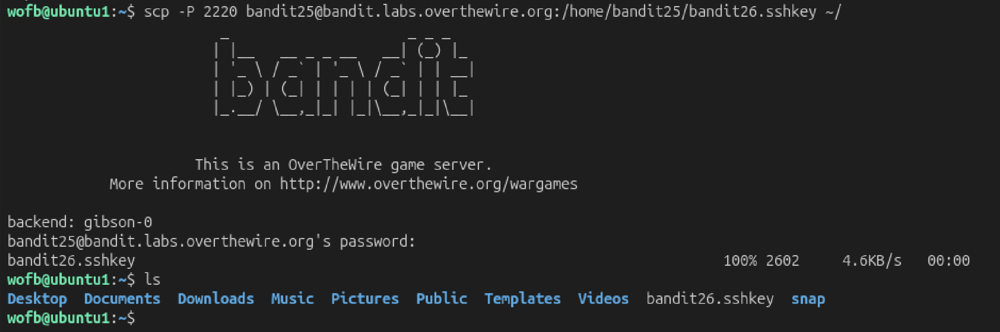
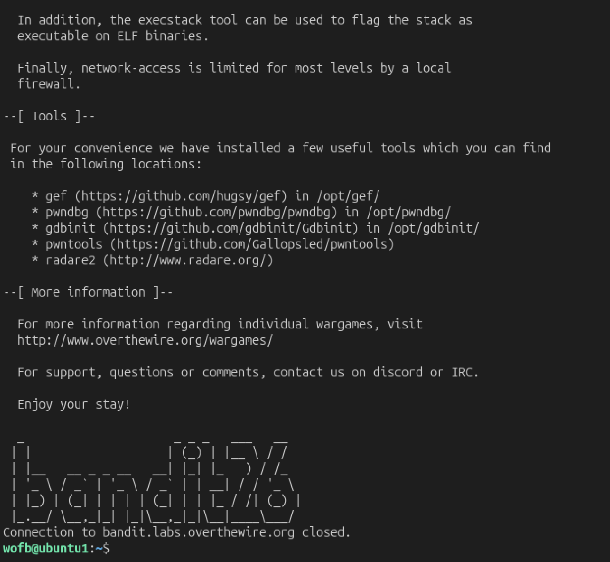
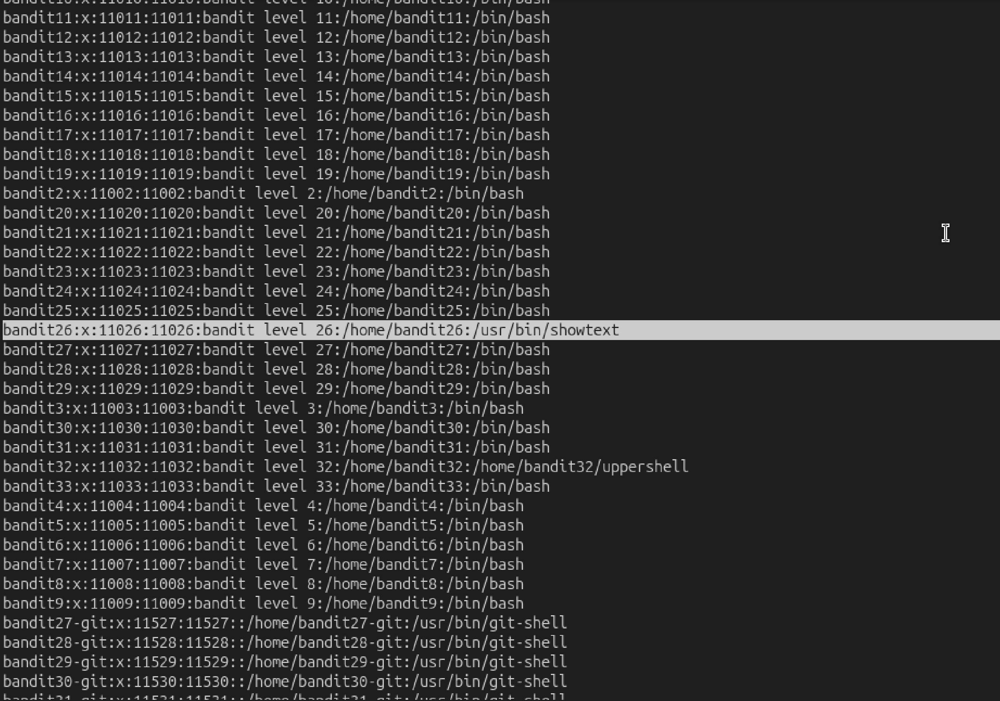
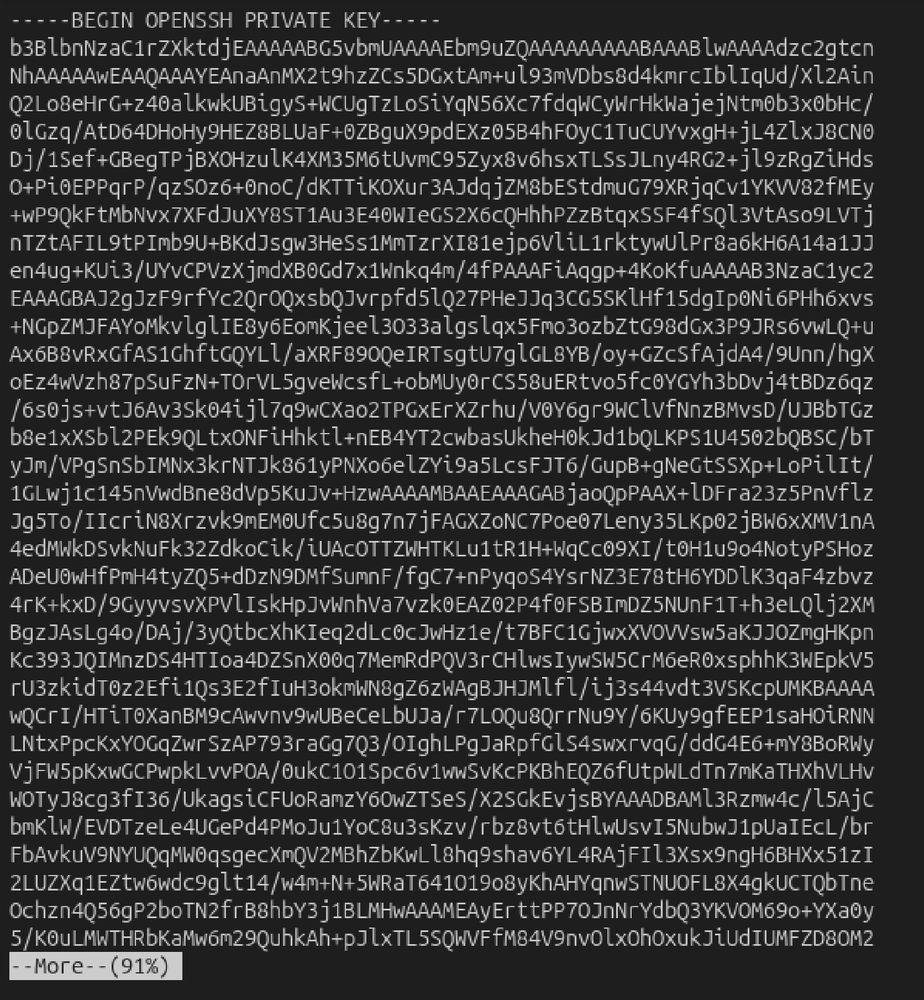
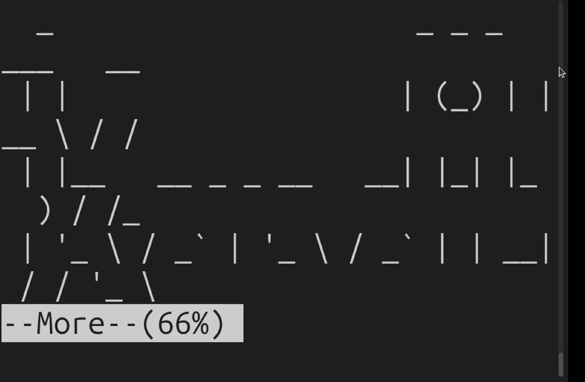
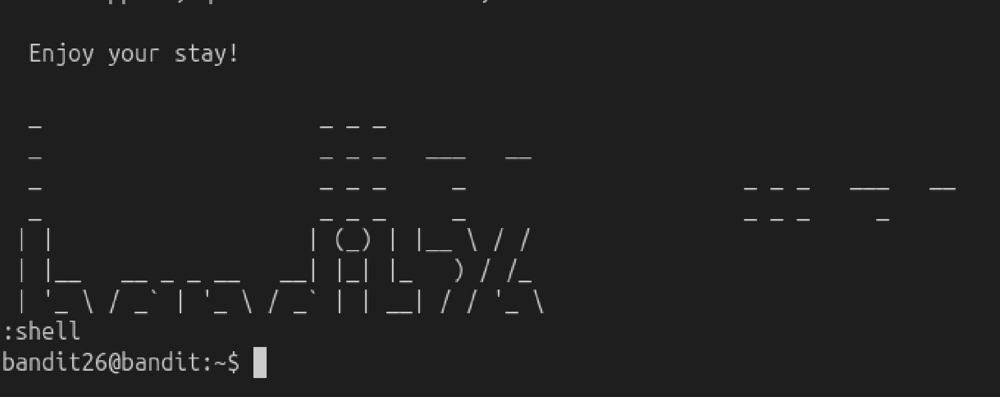

# Mission:
 Find the password in `/etc/bandit_pass/bandit26`. The shell for bandit26 not `/bin/bash`, find out what it is, and how to break out of it.

# Steps:



 First, i see that there is a private key to login bandit26, so i will transfer it to my machine.

 

 Then i will try to login bandit26.
 ```bash
 ssh bandit26@bandit.labs.overthewire.org -p 2220 -i bandit26.sshkey
 ```

 

 But something wrong, after successfull login in, the system suddenly closed. Based on the description, the shell for bandit26 is not `/bin/bash`, i think maybe it is what cause the trouble, so i will find out what it is.

 The “/etc/passwd” file consist of information regarding the users on the device along with the shell that is being used by each user.

 `cat /etc/passwd`

 

 I see that bandit26 is using shell call `showtext`, i will `cat` it to see what inside.

 ```bash
 cat /usr/bin/showtext
 #!/bin/sh

 export TERM=linux

 exec more ~/text.txt
 exit 0
 ```
 This shell will execute the file `text.txt` and use the `more` command. So after executing it, it will automatically exit, which is why the system suddenly closed. The `more` command is like the `cat` command, but it will not display all the content; instead, it shows a percentage at the bottom of the screen indicating how much of the content is displayed.

 
 For example, when i call `more bandit26.sshkey`, it not show out all the content, the more utility is waiting for us to scroll through the content and reach the end at which point the command is finishes this execution. 

 So if the amount of content is more than the size of the terminal, the code will not run until we view all the content.

 

 After resize, the system is waiting until i read all the content, to change the shell script, i press `v` - `vim` to enter the editor shell script.

 I will set shell to /bin/bash, invoking “shell” the user should be loaded into the specified shell.

 ```bash
 :set shell =/bin/bash
 :shell
 ```

 

 Now i'm in bandit26 server, get the password for this level and for bandit27.

 

 The password: `jHdv2ELQhT22BkprMNDjybZDAkw1zeBJ`
