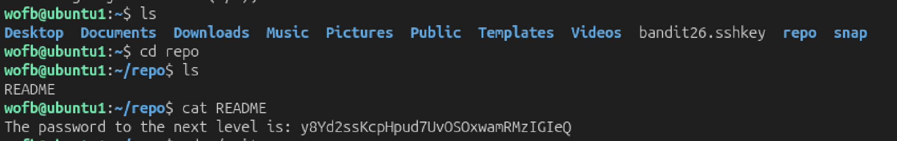

# Mission:
 Clone the git repository ssh://bandit27-git@bandit.labs.overthewire.org/home/bandit27-git/repo via the port 2220 to get the password.

# Steps:
 To clone the git repository, first i will install git to my local machine
 ```bash
 sudo apt install git-all
 ```

 Then use `git clone` to clone a remote Git repository.
 ## Usage:
    Clone a remote Git repository from the internet: 
    git clone https://example.com/repo.git


 ```bash
 git clone ssh://bandit27-git@bandit.labs.overthewire.org:2220/home/bandit27-git/repo
 ```

 
 After clone succes, it creates a `repo` directory in my home directory. Concatenate `README` and get the password.

 The password: `y8Yd2ssKcpHpud7UvOSOxwamRMzIGIeQ`
