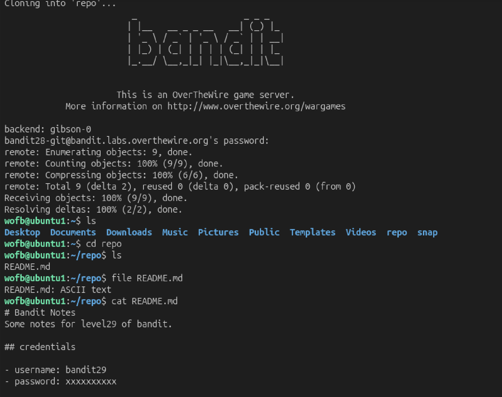
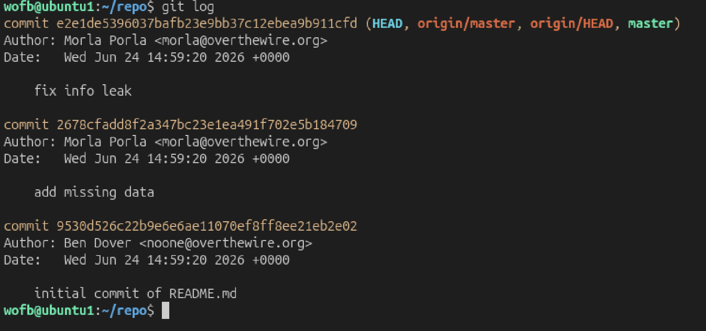
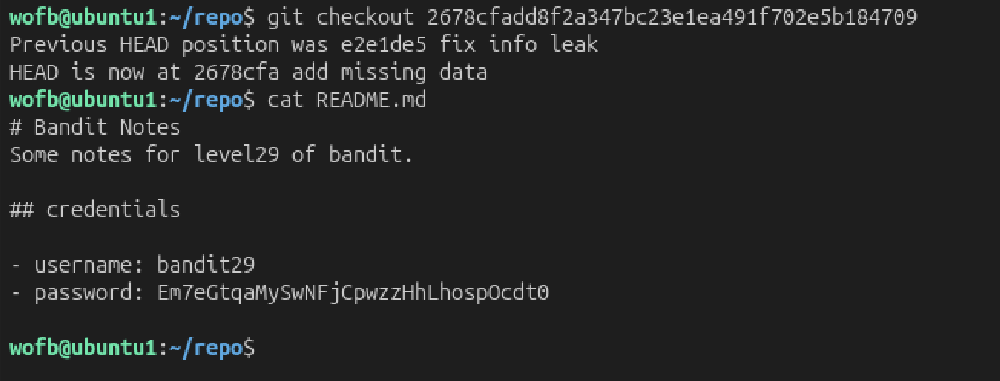

# Mission:
 There is a git repository at ssh://bandit28-git@bandit.labs.overthewire.org/home/bandit28-git/repo via the port 2220. The password for the user bandit28-git is the same as for the user bandit28.

# Steps:

 At this level, i use `git clone` as level 27.

 

 `repo` is already has, so i need to delete it first.

 ```bash
 rm -rf repo
 ```
 ## Explain
 + `-rf`: forces it to delete `repo` recursively.

 

 After concatenate `README.md`, i can see that the password is hiding -> i want to see the commit history of this file. `git log` to show commit log.

 

 Commit `2678cfadd8f2a347bc23e1ea491f702e5b184709` has `add missing data` which i think will be the password, so i will checkout this commit
 ```bash
 git checkout 2678cfadd8f2a347bc23e1ea491f702e5b184709
 ```

 

 After checkout this commit, i read `README.md` again and now the password is showing up.

 The password: `Em7eGtqaMySwNFjCpwzzHhLhospOcdt0`