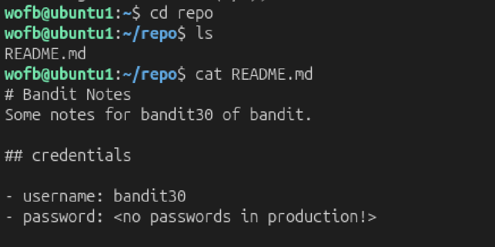
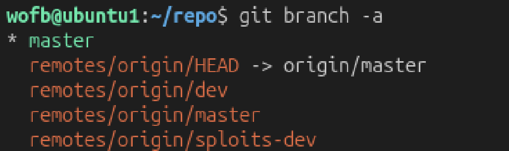

# Mission
 Clone a git repository as previous level then find the password.

# Steps:

 

 After concatenate `README.md`, i can see that there is no password in this file.

 In git, there is `branch` like a separate workspace, i'm in a `master branch`, so i think maybe there is another `branch` where i can find the password, so i call `git branch -a` to see.

 

 Take a look in `remotes/origin/dev` - i just think because there is a word `dev`.

 ```bash
 wofb@ubuntu1:~/repo$ git checkout remotes/origin/dev
Note: switching to 'remotes/origin/dev'.

You are in 'detached HEAD' state. You can look around, make experimental

...

Turn off this advice by setting config variable advice.detachedHead to false

HEAD is now at 0bf8160 add data needed for development

wofb@ubuntu1:~/repo$ cat README.md
# Bandit Notes
Some notes for bandit30 of bandit.

## credentials

- username: bandit30
- password: jq9Dfg2rXsfYsWMgFuKlXhphjdH7USgX
```

The password: `jq9Dfg2rXsfYsWMgFuKlXhphjdH7USgX`.