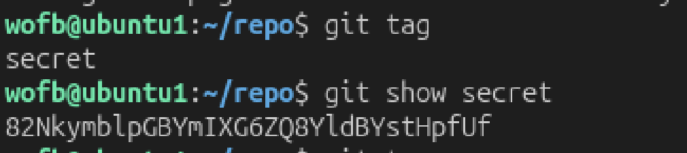

# Mission:
 Clone a git repository as previous level then find the password.

# Steps:

 

 Okay, so we now about log, branch. There is a thing in git call `tag` - A Git tag is a reference that points to a specific point in Git history, acting like a permanent bookmark or label for a specific commit.

 So, too view a tag history, very simple.
 ```bash
 git tag
 ```

 

 The password: `82NkymblpGBYmIXG6ZQ8YldBYstHpfUf`

 