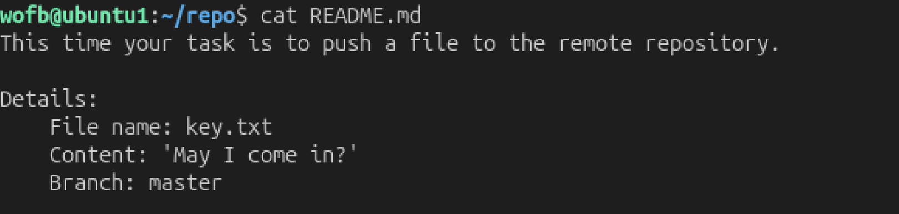
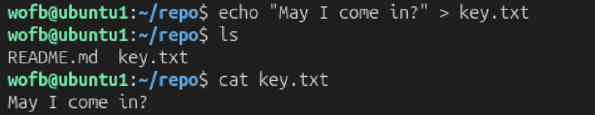
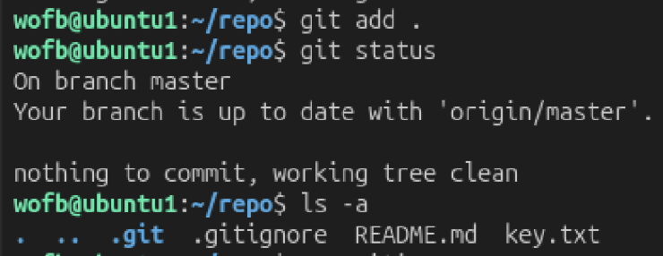
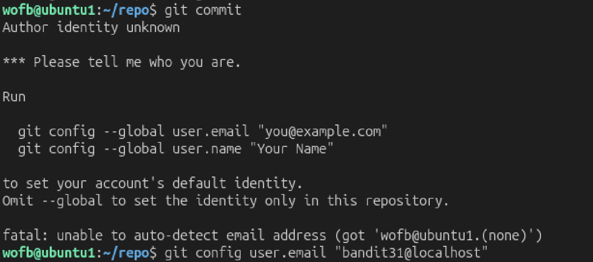

# Mission:
  Clone a git repository as previous level then find the password.

# Steps:

 

 At this level, i will learn how to add, commit, push a file to the remote repository.

 

 I create a file `key.txt` as required, then i will add it by `git add .`.

 

 After i call `git add .`, the status still not update because there is `.gitignore`
 ```bash
  cat .gitignore 
  *.txt
 ```

 This file will ignore all the file has `.txt`, so to add `key.txt`, i have to remove `.gitignore`.
 ```bash
 rm .gitignore
 git add .
 ```
 
 

 Then i commit it, but there is a problem `Author identity uknown`, so i have to set a display name attached to my Git commit, here is `bandit31@localhost`.

```bash
wofb@ubuntu1:~/repo$ git add .
wofb@ubuntu1:~/repo$ git commit -m "Update"
[master 9b524a0] Update
 1 file changed, 1 insertion(+), 1 deletion(-)
wofb@ubuntu1:~/repo$ git push origin master
                         _                     _ _ _   
                        | |__   __ _ _ __   __| (_) |_ 
                        | '_ \ / _` | '_ \ / _` | | __|
                        | |_) | (_| | | | | (_| | | |_ 
                        |_.__/ \__,_|_| |_|\__,_|_|\__|
                                                       

                      This is an OverTheWire game server. 
            More information on http://www.overthewire.org/wargames

backend: gibson-0
bandit31-git@bandit.labs.overthewire.org's password: 
Enumerating objects: 7, done.
Counting objects: 100% (7/7), done.
Delta compression using up to 4 threads
Compressing objects: 100% (4/4), done.
Writing objects: 100% (6/6), 534 bytes | 534.00 KiB/s, done.
Total 6 (delta 0), reused 0 (delta 0), pack-reused 0 (from 0)
remote: ### Attempting to validate files... ####
remote: 
remote: .oOo.oOo.oOo.oOo.oOo.oOo.oOo.oOo.oOo.oOo.
remote: 
remote: Well done! Here is the password for the next level:
remote: pWuj5jBQ6IgV0NXwiH6g1pXRF8S1YvbT 
remote: 
remote: .oOo.oOo.oOo.oOo.oOo.oOo.oOo.oOo.oOo.oOo.
remote: 
remote: 
remote: .oOo.oOo.oOo.oOo.oOo.oOo.oOo.oOo.oOo.oOo.
remote: 
remote: Wrong!
remote: 
remote: .oOo.oOo.oOo.oOo.oOo.oOo.oOo.oOo.oOo.oOo.
remote: 
To ssh://bandit.labs.overthewire.org:2220/home/bandit31-git/repo
 ! [remote rejected] master -> master (pre-receive hook declined)
error: failed to push some refs to 'ssh://bandit.labs.overthewire.org:2220/home/bandit31-git/repo'
```

The password: `pWuj5jBQ6IgV0NXwiH6g1pXRF8S1YvbT`.