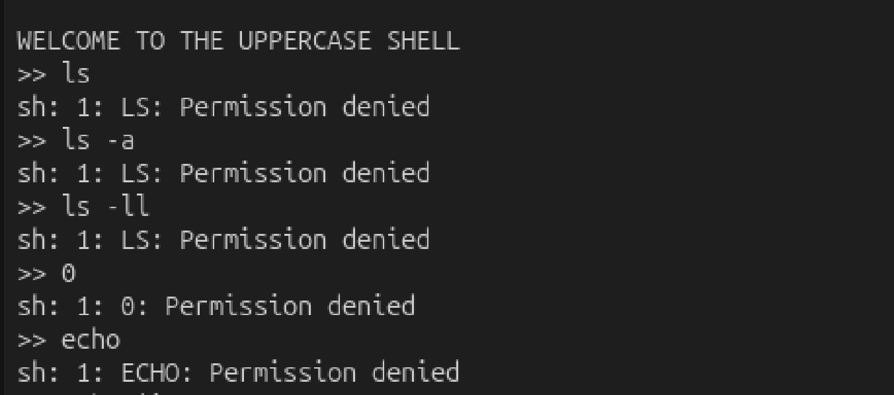
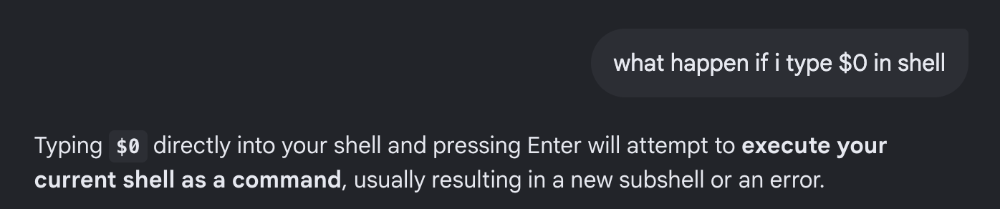
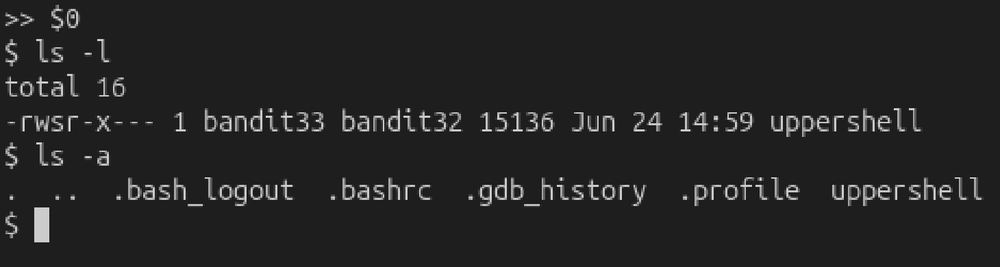
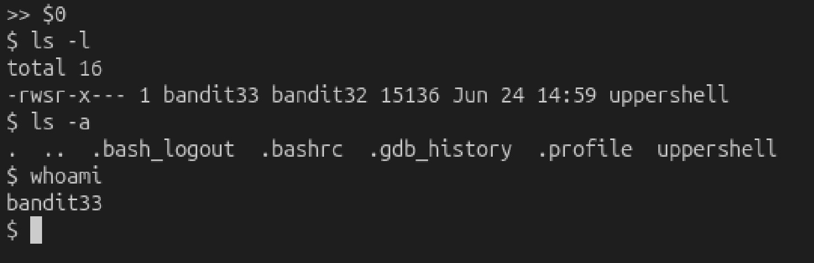
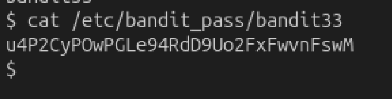

# Mission:
 After all this git stuff, it’s time for another escape. Good luck!

# Steps:

 ...
 Okay, sooooooo at this level, i don't know what to do seriously.

 

 As you can see, everything i type in has always been `permission denied` cause it turn from **lowercase to uppercase.**

 After google for a long time, i find out how to escape this. 

 In linux shell, `$0` is a special variable that represents the name of the shell or the shell script currently being executed.

 

 -> If i type `$0`, it will spawn a new shell.

 

 Okay, now i can call `ls`, `cat`, `echo`,... so after checking what i have here, i find out that i'm user `bandit33`

 

 -> `cat /etc/bandit_pass/bandit33` and get the password.

 

 The password: `u4P2CyPOwPGLe94RdD9Uo2FxFwvnFswM`.

