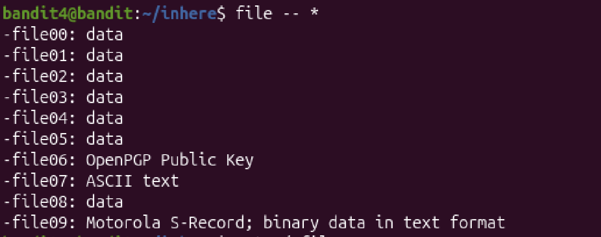

# Mission:
 Find the password located in the only human-readable file in the "inhere" directory.

# Steps:
 
 First, use `cd inhere` to move to "inhere" directory.
 
 Then i use `ls` to see all files i have in this directory
 

 Human-readable file is file stored in text(ASCII), so i use `file -- *` to see which file type is ASCII
 

 Now i know that file i need to read is "-file07"
 

 Password: `6C7h9GD8M6ai5nr7wo1RonrzFjj9yIrG`
 