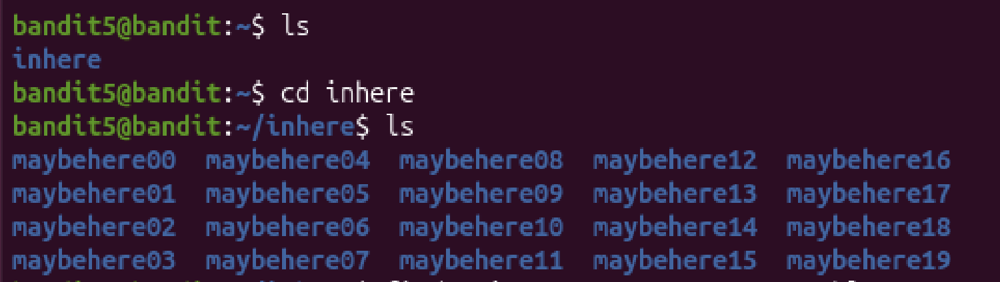

# Mission
<<<<<<< Updated upstream
 This level is quite difficult; I have to find the password stored in a file that has all of the following properties:\
=======
 This level is quite difficult, i have to find the password stored in a file that has all of the following properties:\
>>>>>>> Stashed changes
  +human-readable\
  +1033 bytes in size\
  +not executable


# Steps:
 
 ### At this level, i need to use the `find` command to search for file that meet the conditions.
 First, i move into the "inhere" directory
 ```bash
  cd inhere
 ```

 ### Then i list all the directories that i have and find out how many folders there are.
 


 ### Now i want to find exactly the file that meet all conditions:
  +human-readable\
  +1033 bytes in size\
  +not executable
 
 ```bash
 bandit5@bandit:~/inhere$ find -size 1033c -not -executable 
./maybehere07/.file2
 ```

 ### Explain the command:
  + **-size 1033c**: 1033c means 1033 bytes, 'c' for bytes, 'k' for kibibytes, 'M' for mibibytes, 'G' for gibibytes.
  + **-not -executable**: As the task requires not executable property, i have to add `-not` before `-executable`.

 ### As i see, the password is located in `./maybehere07/.file2`  path.

 ```bash
 bandit5@bandit:~/inhere$ cat ./maybehere07/.file2
pXa26xhMWaC2SvDotA4r9EgZkulOeSBW
 ```

 ### The password: `pXa26xhMWaC2SvDotA4r9EgZkulOeSBW`
 


