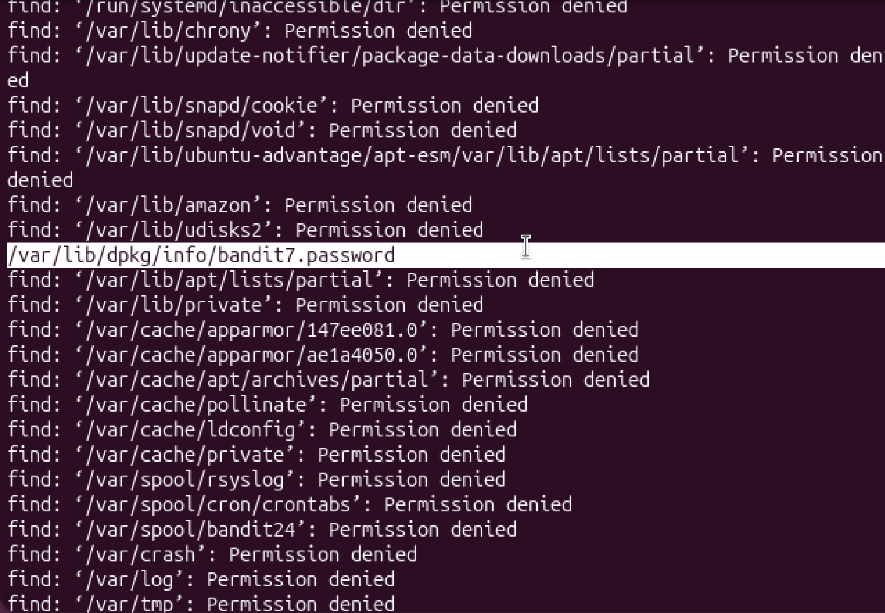

# Mission:
 In this level, i have to find the password which is stored SOMEWHERE ON THE SERVER and has the following properties:
 + owned by user bandit7
 + owned by group bandit6
 + 33 bytes in size


# Steps:

 I still use the `find` command that i learned from level 5, but this time, i will have to search the entire server because i don't know exactly where the password is.
 
 ### -> use `/`( `/` is the root directory on Linux similar to the C:/ Drive on Windows)

 ```bash
 bandit6@bandit:~$ find / -group bandit6 -user bandit7 -size 33c
 ```

 ### Explain the code:
 + **-group bandit6**: search for file which is owned by group bandit6
 + **-user bandit7**: search for file which is owned by user bandit7
 + **-size 33c**: search for file that has 33 bytes in size.

 
 Scroll up a little bit, i find this path seems like what i need, i read it to see if it really has the password.

 ```bash
 bandit6@bandit:~$ cat /var/lib/dpkg/info/bandit7.password
Bmnnvf82KzQlfxgAI2d1zYbr1u9pr3E3
 ```

 ### Password: `Bmnnvf82KzQlfxgAI2d1zYbr1u9pr3E3`
 