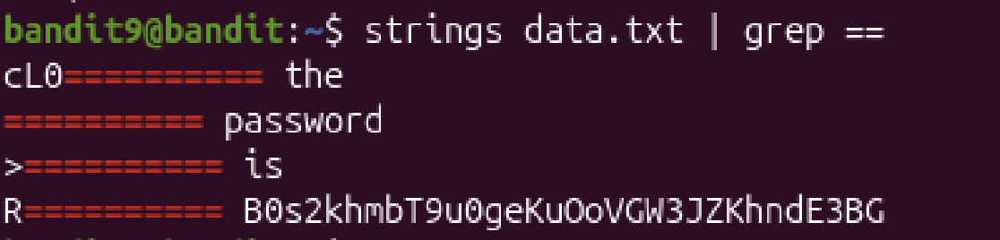

# Mission:
 Find the password in file `data.txt`, in human-readable strings and preceded by several `=` characters.

# Steps:
 To filter the human-readable strings, i use the`strings` command combine with the `grep` command to search for `=`.
 ### Remember to use the `strings` command before the `grep` command.

 ## Usage:
  + `grep [OPTION]... PATTERNS [FILE]...`
  + `strings [option(s)] [file(s)]`

 ```bash
  bandit9@bandit:~$ strings data.txt | grep ==
 ```
 

 The Password: `B0s2khmbT9u0geKuOoVGW3JZKhndE3BG`
